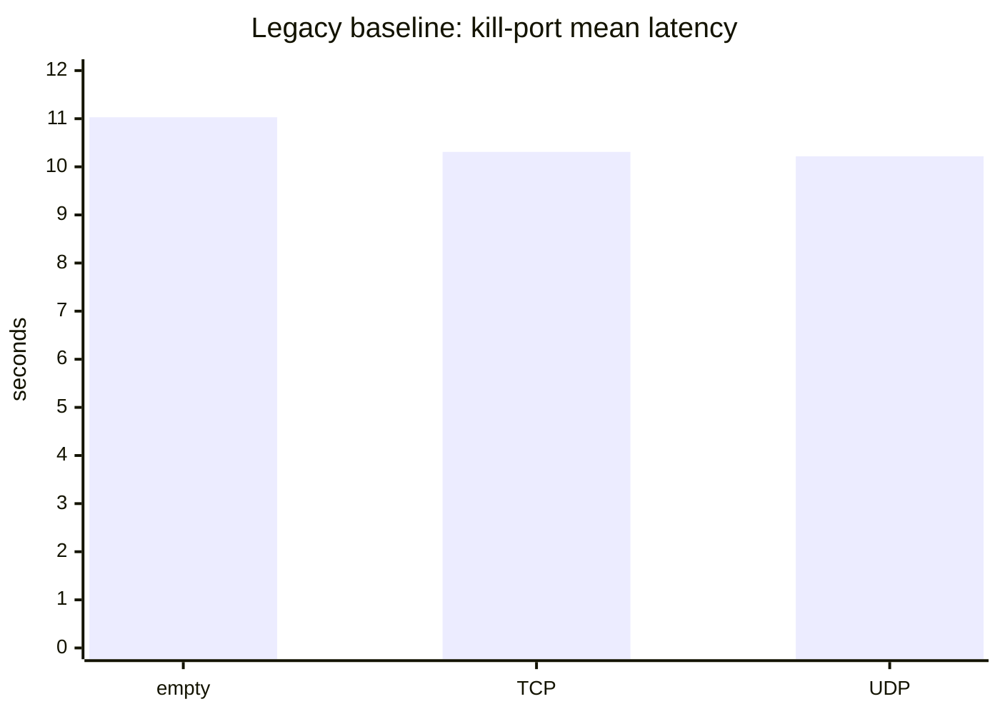
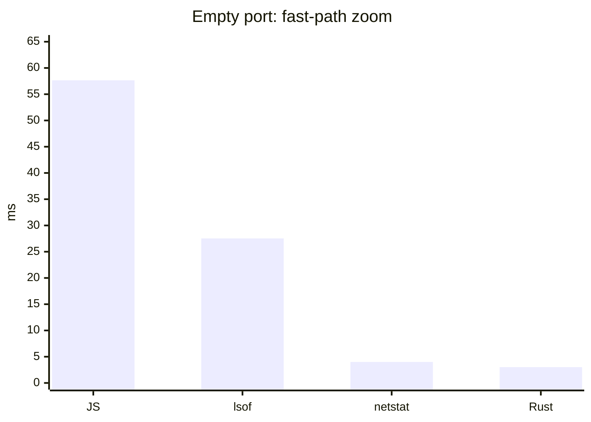
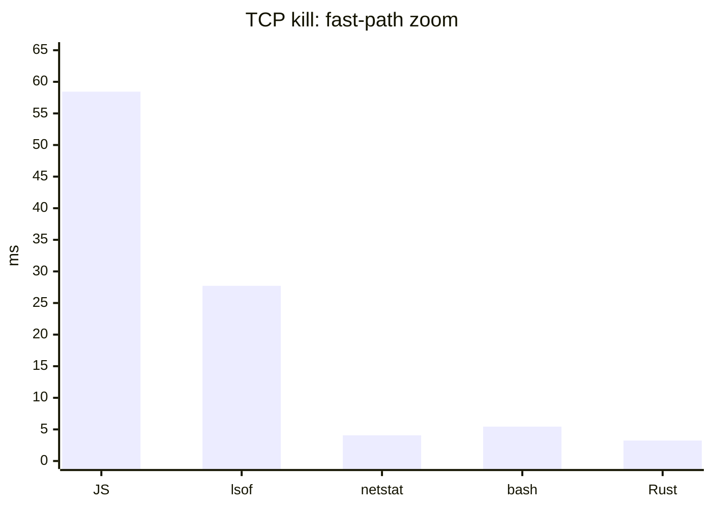
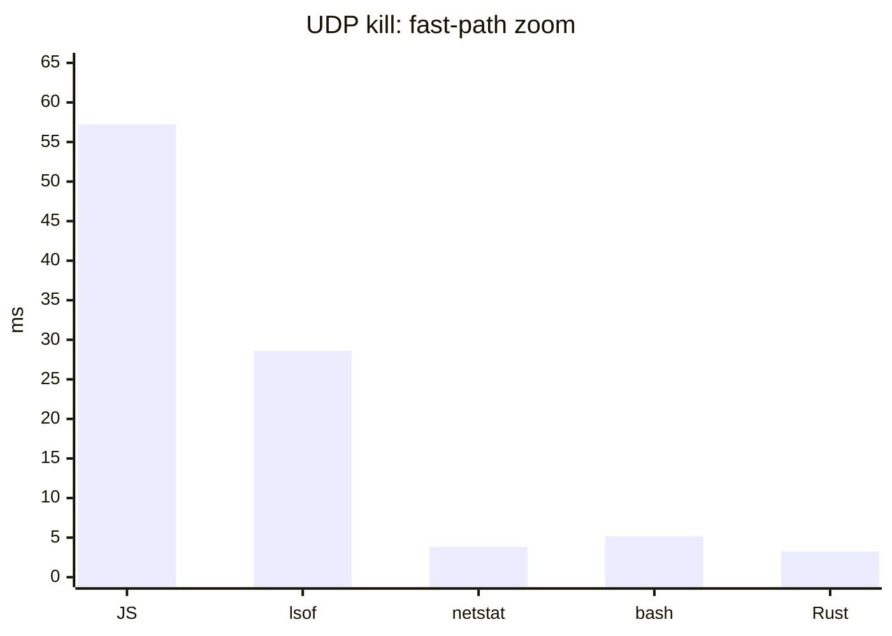
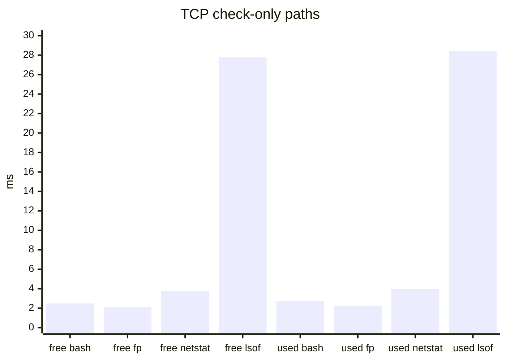

# kill-port-now

API-compatible `kill-port` replacement that makes Rust the default CLI path.

Killing one port should not take seconds. `kill-port@2.0.1` scans every open socket, then runs `lsof | grep | awk | xargs kill -9`. `kill-port-now` ships a no-dependency Rust CLI where a prebuild is available, plus a JS fallback that uses one targeted `lsof` lookup.

Use it as a drop-in for documented `kill-port` calls on macOS/Linux: `kill(port)` and `kill(port, 'udp')`. If you inspect the resolved value, the JS API returns a structured result.

## Install

```sh
npm i -g kill-port-now
```

## Use

```sh
kp 3000
kill-port 3000
kill-port-now 3000 5173
kill-port-now --port 3000,3001 --protocol all
fp 3000
```

## Benchmark

Local macOS benchmark, 3 iterations. Lower is better.

| Operation | `kill-port` | JS fallback | raw `lsof` | raw `netstat` | bash `netstat` | Rust default |
| --- | ---: | ---: | ---: | ---: | ---: | ---: |
| Empty port | `11032.29 ms` | `57.65 ms` | `27.53 ms` | `4.00 ms` | — | `3.02 ms` |
| TCP kill | `10311.02 ms` | `58.44 ms` | `27.72 ms` | `4.07 ms` | `5.44 ms` | `3.24 ms` |
| UDP kill | `10219.75 ms` | `57.22 ms` | `28.62 ms` | `3.81 ms` | `5.16 ms` | `3.25 ms` |

TCP check-only rows:

| Check | bash `/dev/tcp` | `fp-rs` | raw `netstat` | raw `lsof` |
| --- | ---: | ---: | ---: | ---: |
| Free port | `2.49 ms` | `2.13 ms` | `3.73 ms` | `27.77 ms` |
| In-use port | `2.72 ms` | `2.25 ms` | `3.98 ms` | `28.44 ms` |

### Mermaid charts

Raw-scale charts hide the useful comparison because `kill-port` is around 10 seconds while the fast paths are 3–60 ms. These charts split the baseline from the fast-path zoom.











Speedup over `kill-port`:

| Operation | JS fallback | raw `lsof` | raw `netstat` | bash `netstat` | Rust default |
| --- | ---: | ---: | ---: | ---: | ---: |
| Empty port | `191x` | `401x` | `2,758x` | — | `3,653x` |
| TCP kill | `176x` | `372x` | `2,533x` | `1,895x` | `3,182x` |
| UDP kill | `179x` | `357x` | `2,682x` | `1,981x` | `3,145x` |

Full dashboard:

```sh
open benchmarks/index.html
npm run bench:native
```

## Native CLI

The published bins are `kill-port`, `kill-port-now`, `kp`, `free-port-now`, and `fp`.

- Rust prebuilds are used by default when bundled for the platform.
- `kp-rs` does not call `lsof`; it uses `libproc` on macOS and `/proc` on Linux.
- macOS can also do a fast no-`lsof` shell path with `netstat -anv -p tcp|udp` because verbose output includes `command:pid`.
- bash `/dev/tcp` can check TCP reachability, but it cannot identify or kill the owning PID.
- `fp-rs` checks TCP availability without `lsof`.
- The JS fallback remains API-compatible and dependency-free.

## Options

```txt
-p, --port <ports>       Comma-separated or repeated ports
-m, --method <protocol>  Alias for --protocol
    --protocol <value>   tcp, udp, or all (default: tcp)
-s, --signal <signal>    Signal to send (default: SIGKILL)
    --dry-run            Print matches without killing
    --strict             Exit 1 when nothing was killed
-q, --quiet              No success output
-v, --verbose            Print matched PIDs
```

## API

```js
const killPort = require('kill-port-now')

await killPort(3000)
await killPort(3000, 'udp')
await killPort.killPorts([3000, 5173], { protocol: 'all' })
```

## API compatibility

| Behavior | Status |
| --- | --- |
| `require('kill-port-now')(port)` | API-compatible |
| `kill(port, 'tcp' | 'udp')` | API-compatible |
| Free port rejection | API-compatible |
| Success return value | Different: structured result |
| Windows | Not supported |

Node.js 18+. macOS and Linux. Native prebuilds currently ship for macOS arm64/x64; other supported platforms use the JS fallback until their prebuilds are added.

## License

MIT
