# kill-port-now

Kill the process listening on a port in milliseconds.

`kill-port-now` is an API-compatible replacement for [`kill-port`](https://www.npmjs.com/package/kill-port). It keeps the familiar Node API, adds a short `kp` CLI, and uses a native Rust binary when available with a dependency-free Node fallback.

## Install

```sh
npm i -g kill-port-now
```

Node.js 18+ is required for the package API.

## CLI

```sh
kp 3000
kp 3000 5173
kp --port 3000,3001 --protocol all
kp --dry-run --verbose 3000
```

TCP is the default protocol. Use `--protocol udp` for UDP sockets or `--protocol all` to check both. Run `kp --help` for every option.

## Node API

```js
const kill = require('kill-port-now')

await kill(3000)
await kill(3000, 'tcp')
await kill(3000, 'udp')
await kill(3000, { protocol: 'all', signal: 'SIGTERM' })
```

## Benchmark

Local macOS benchmark, 3 iterations. Lower latency is better.

| Operation | `kill-port` | `kill-port-now` | Faster |
| --- | ---: | ---: | ---: |
| Empty port | `11032.29 ms` | `3.02 ms` | `3,653x` |
| UDP kill | `10219.75 ms` | `3.25 ms` | `3,140x` |
| TCP kill | `10311.02 ms` | `3.24 ms` | `3,185x` |

```mermaid
xychart-beta
    title "Benchmark latency (ms)"
    x-axis ["Empty port", "UDP kill", "TCP kill"]
    y-axis "Latency (ms)" 0 --> 12000
    bar "kill-port" [11032.29, 10219.75, 10311.02]
    bar "kill-port-now" [3.02, 3.25, 3.24]
```



```sh
npm run bench:native
open benchmarks/index.html
```

## Development

See [docs/development.md](docs/development.md) for architecture, benchmarks, native prebuilds, fallback paths, and release steps.

## License

MIT
