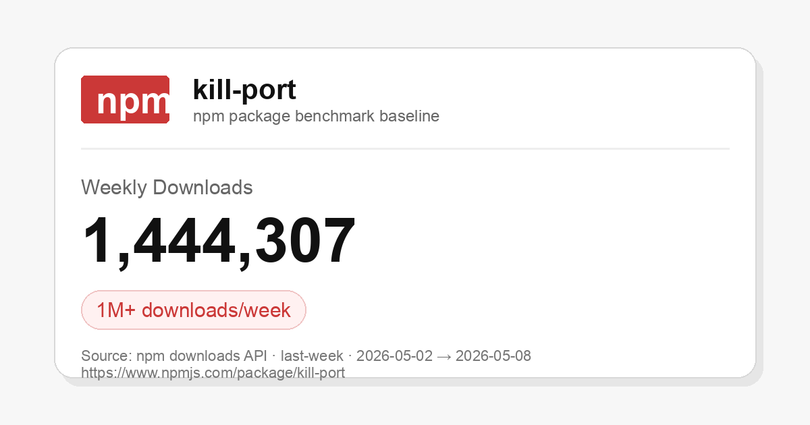
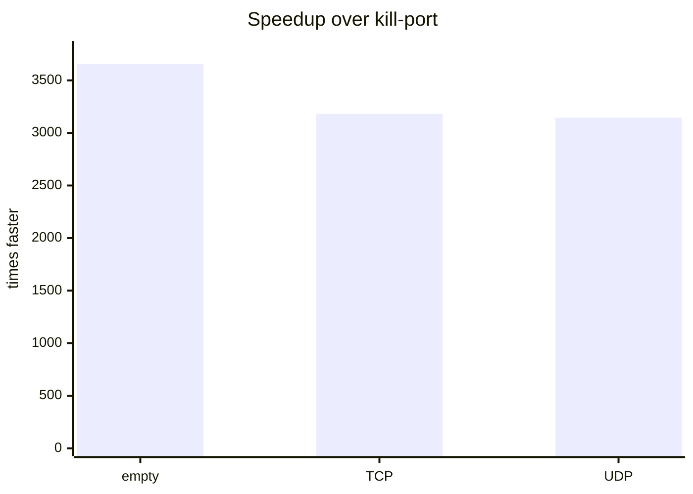
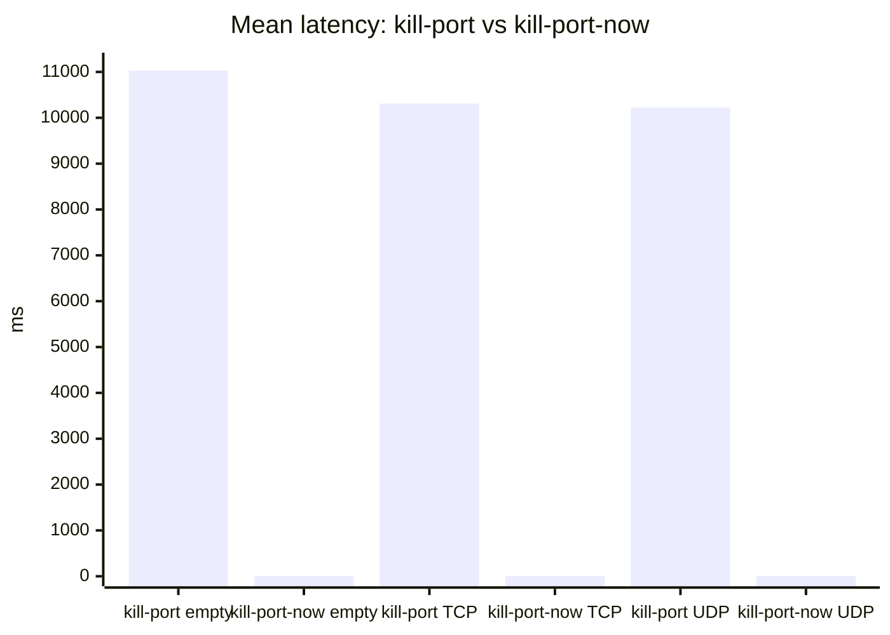

<div align="center">
  
</div>
<h1 align="center">kill-port-now</h1>
<div align="center">
  <strong>API-compatible kill-port replacement that's 3,000x+ faster.</strong>
</div>
<br>
<div align="center">
  <a href="https://npmjs.org/package/kill-port-now">
    
  </a>
  <a href="https://npmjs.org/package/kill-port-now">
    
  </a>
  <a href="./LICENSE">
    
  </a>
  =18" />
  
</div>
<br>

[`kill-port@2.0.1`](https://www.npmjs.com/package/kill-port) has 1M+ weekly downloads, but a single port kill can take ~10 seconds on macOS. `kill-port-now` keeps the documented `kill-port` API and uses a no-dependency Rust CLI by default.

[](https://www.npmjs.com/package/kill-port)

Source: [npm package page](https://www.npmjs.com/package/kill-port) · [npm downloads API](https://api.npmjs.org/downloads/point/last-week/kill-port)

## Install

```sh
npm i -g kill-port-now
```

## Use

```sh
kp 3000
kp 3000 5173
kp --port 3000,3001 --protocol all
```

## How much faster?

Local macOS benchmark, 3 iterations. Lower is better.

| Operation | `kill-port` | `kill-port-now` | Faster |
| --- | ---: | ---: | ---: |
| Empty port | `11032.29 ms` | `3.02 ms` | `3,653x` |
| TCP kill | `10311.02 ms` | `3.24 ms` | `3,182x` |
| UDP kill | `10219.75 ms` | `3.25 ms` | `3,145x` |





Full benchmark dashboard:

```sh
open benchmarks/index.html
npm run bench:native
```

## API-compatible with `kill-port`

```js
const kill = require('kill-port-now')

await kill(3000)
await kill(3000, 'tcp')
await kill(3000, 'udp')
```

Compatibility:

| Behavior | Status |
| --- | --- |
| `kill(port)` | Compatible |
| `kill(port, 'tcp')` | Compatible |
| `kill(port, 'udp')` | Compatible |
| Free port rejection | Compatible |
| Multiple ports | Compatible |

## Binary

The package exposes one global binary:

- `kp`

`kp` uses the native Rust prebuild by default where available. Node.js 18+ is required for the package API.

## Options

```txt
-p, --port <ports>       Comma-separated or repeated ports
-m, --method <protocol>  Alias for --protocol
    --protocol <value>   tcp, udp, or all (default: tcp)
-s, --signal <signal>    Signal to send (default: SIGKILL)
    --dry-run            Print matches without killing
    --strict             Exit 1 when nothing was killed
-q, --quiet              No success output
-v, --verbose            Print matched PIDs
```

## Development

See [docs/development.md](docs/development.md) for architecture, benchmark methodology, fallback paths, native prebuilds, and release steps.

## License

MIT
