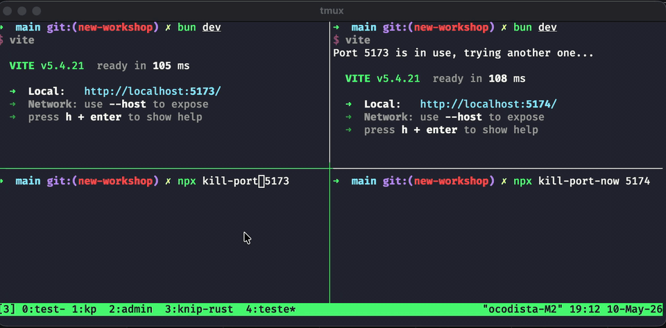
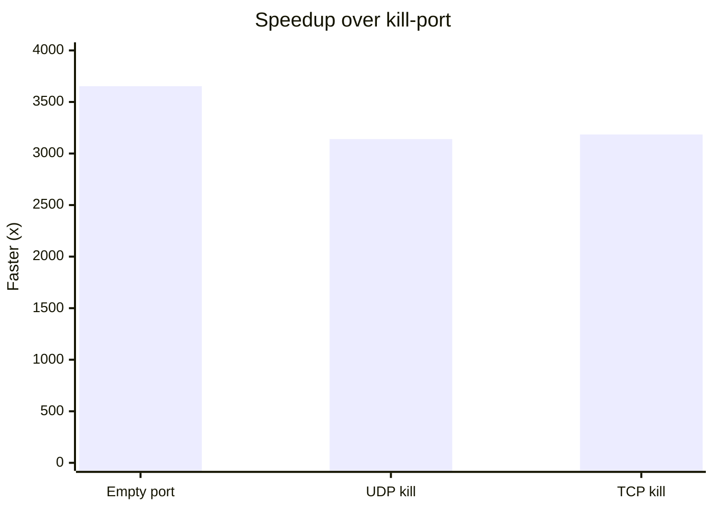

# kill-port-now

Free a local port in milliseconds.

`kill-port-now` is an API-compatible replacement for [`kill-port`](https://www.npmjs.com/package/kill-port). It keeps the familiar Node API, adds a short `kp` CLI, and uses one native Rust binary for lookup and killing.

## Install

```sh
npm i -g kill-port-now
```

Node.js 18+ is required for the package API.

The package does not run `preinstall`, `install`, or `postinstall` scripts. The `kp` launcher selects the bundled native binary at runtime. If a release is missing the native binary for your platform, it fails loudly instead of falling back to shell tools.

## CLI

```sh
kp 3000
kp 3000 5173
kp 3000 --dry-run --json
kp 3000 --tcp-only
kp 3000 --udp-only
kp 3000 --graceful --graceful-timeout 300
```

By default, `kp 3000` kills every process holding local port `3000`, across TCP and UDP. Protocol filters are escape hatches: use `--tcp-only` or `--udp-only` only when you need them. Run `kp --help` for every option.

## Node API

```js
const kill = require('kill-port-now')
const { findPortProcesses } = require('kill-port-now')

await kill(3000)
await kill(3000, 'udp') // legacy kill-port method argument still works
await kill(3000, { signal: 'SIGTERM' })
await kill(3000, { graceful: true, gracefulTimeoutMs: 300 })

const processes = await findPortProcesses(3000)
```

`findPortProcesses()` returns process metadata when the native backend can provide it:

```ts
type PortProcess = {
  pid: number
  port: number
  protocol: 'tcp' | 'udp'
  command?: string
  path?: string
}
```

## Benchmark

Watch `kill-port-now` recover a dev server while `kill-port` kills the wrong one:



[Download the MP4](./docs/assets/diff-demo.mp4).

Local macOS benchmark, 3 iterations. Lower latency is better.

| Operation | `kill-port` | `kill-port-now` | Faster |
| --- | ---: | ---: | ---: |
| Empty port | `11032.29 ms` | `3.02 ms` | `3,653x` |
| UDP kill | `10219.75 ms` | `3.25 ms` | `3,140x` |
| TCP kill | `10311.02 ms` | `3.24 ms` | `3,185x` |



```sh
npm run bench:native
open benchmarks/index.html
```

## Development

See [docs/development.md](docs/development.md) for architecture, benchmarks, native prebuilds, and release steps.

## License

MIT
